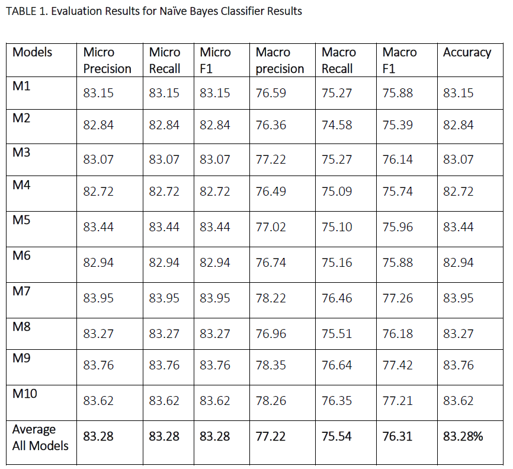

## Naive Bayes in Python on the "adult-big" dataset

Source for data: https://archive.ics.uci.edu/ml/datasets/adult

Prepare the dataset:

-  Parse/clean up the dataset input file and store data

Data preprocessing steps:

-  Calculate numeric and nominal attributes means
-  Replace missing values in the data set (with mean for numeric and mode for nominal attributes)
-  Entropy-based discretization: 
-	   calculate entropy and information gain to find best splitting values for nominal/ categorical attributes 
-  Update the nominal attribute values with discretized values
 
Training and testing Naive Bayes classifier steps:

-  Perform K fold cross validation to divide data into Train Set and Test Sets
-  Training
-	   calculate Prior probabilities
-	   calculate Likelihoods

-  NB classification steps:  
-	   calculate Posterior probabilities for each test sample and determine predictions of the class labels
-	   store and output evaluation metrics: accuracy, micro precision, micro recall, macro precision, macro recall, F1)

-  Parameters to tune: 
    k = number of folds for cross validation
    pos = position of categorical attribute to discretize

Results

 
